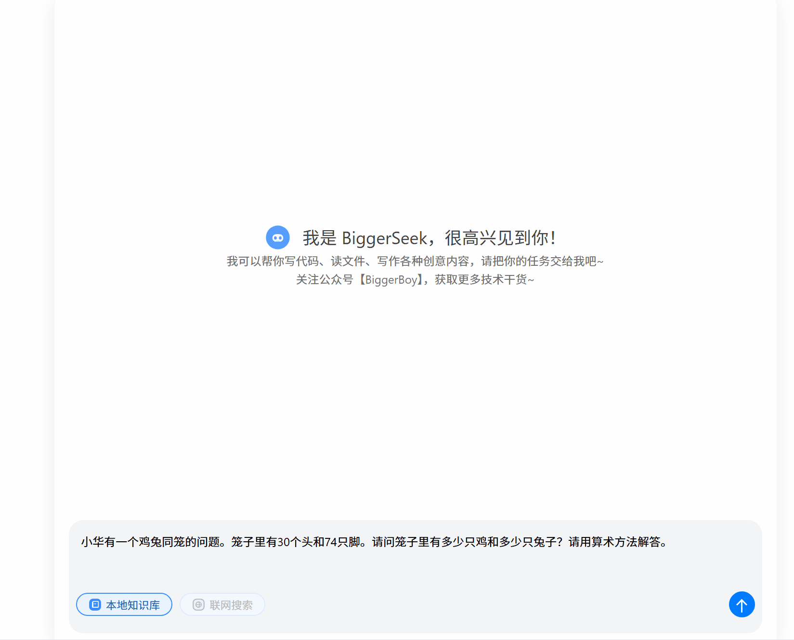
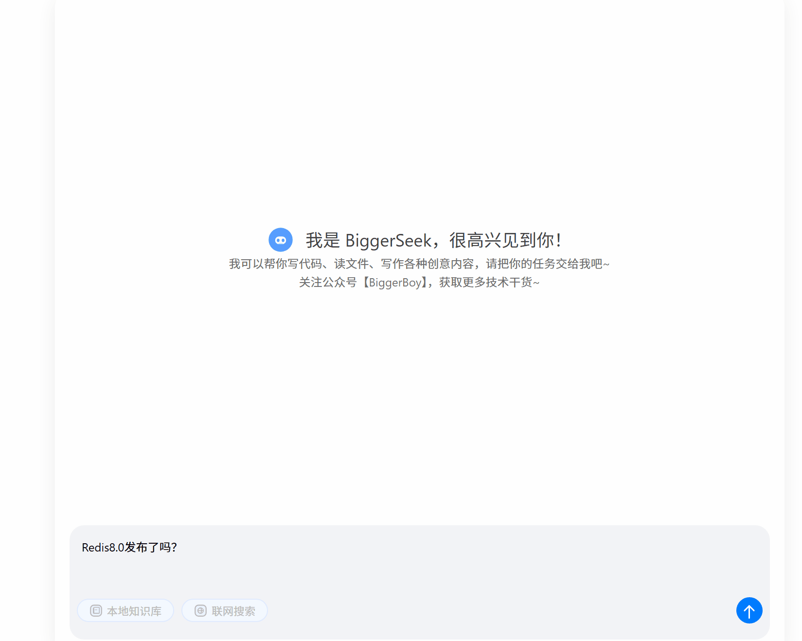
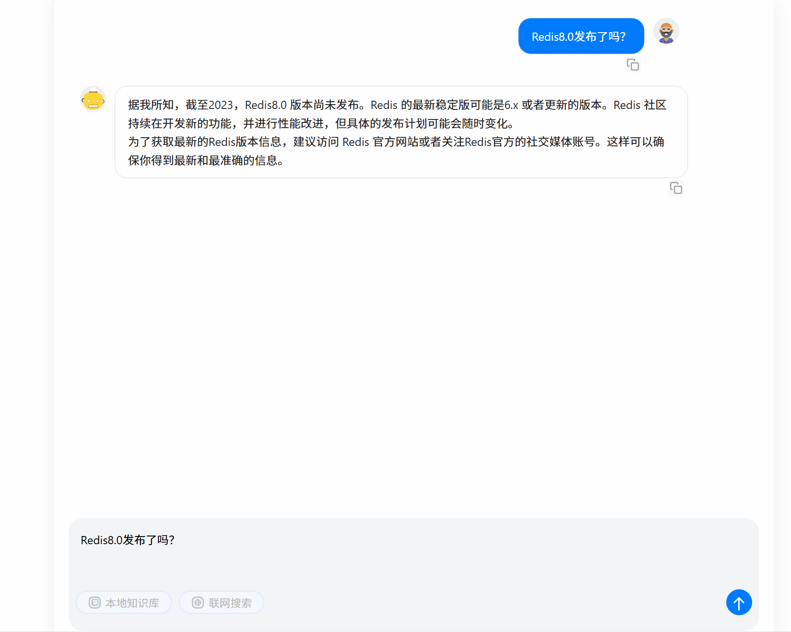
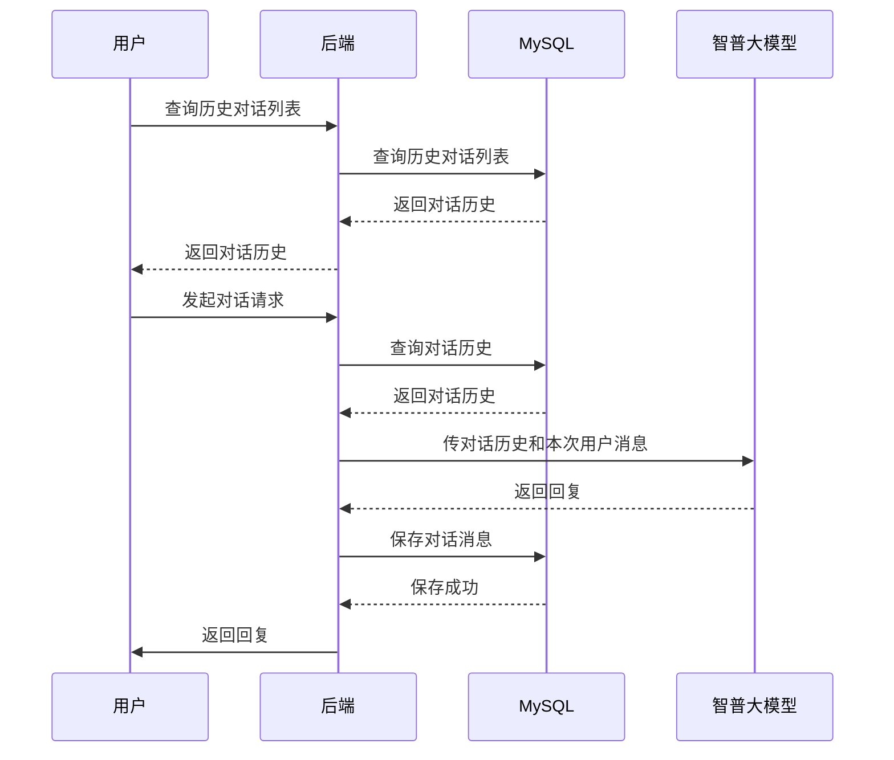
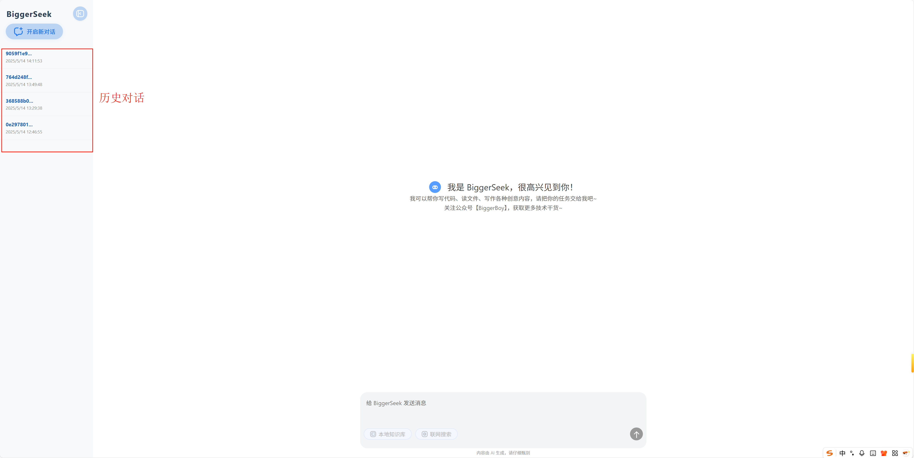

关注公众号【BiggerBoy】，获取更多技术干货！


### 知识回顾与项目亮点

在[《Spring AI：Java开发者的智能应用开发指南》](https://mp.weixin.qq.com/s/-lv-1hyJiENdoZG3wVrYEg)技术解析基础上，本次实战项目将实现三大突破：

**1. 全栈架构实现**
- [x] 后端：基于Spring AI构建智普大模型接入层
- [x] 前端：Vue3+Marked实现交互式聊天界面和Markdown渲染
- [x] 存储：Redis 向量数据库支撑知识增强

**2. 企业级知识增强**
通过RAG（检索增强生成）技术实现：
- [x] 本地知识库向量化存储
- [x] 基于语义的精准知识检索
- [x] 上下文感知的智能回复生成

**3. 生产级特性**
- [x] 流式响应处理（SSE）
- [x] 对话历史管理
- [ ] 多文档格式解析支持

### 效果抢先看

启动项目，与AI对话：



无本地知识库时，未掌握的内容无法准确回复：




有本地知识库时，AI能准确回复：



### 开发手记
一、环境准备
1. 配置JDK17+环境
2. [申请智普API_KEY](https://open.bigmodel.cn/login)
3. 初始化SpringAI项目

二、核心功能实现
```java
// 智普大模型接入示例
@Bean
public ChatClient chatClient(AiClient aiClient) {
    return new ZhiPuChatClient(aiClient)
           .withTemperature(0.7)
           .enableStreaming();
}
```

三、企业级扩展
1. 文档解析器配置
2. 向量索引构建
3. 检索增强管道实现

▍配套源码
关注公众号【BiggerBoy】，回复「AI全栈」获取完整工程代码，包含：
- 后端SpringBoot工程：https://github.com/biggerboy/BiggerBoyAI
- 前端Vue3工程：https://github.com/biggerboy/BiggerBoyAI-front

（注：本教程已通过SpringAI 1.0.0-M8 + SpringBoot 4.0.0验证）

### 更新日志
#### 支持会话历史上下文感知 

2025年5月15日更新

- 修改Spring Boot版本为3.3.11，原来4.0.0时引入mybatis-plus报错，修改后可正常运行。
- 引入MySQL数据库，用于存储会话和消息
- 提供会话列表查询和消息列表查询接口
- 支持上下文感知的智能回复生成，提升了对话的连贯性和准确性。
- 支持对话历史管理，用户可以查看和删除历史记录。

实现流程：


效果：


历史对话和多轮对话展示：


